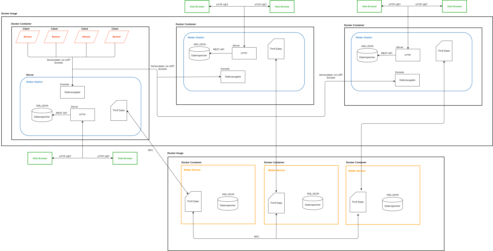
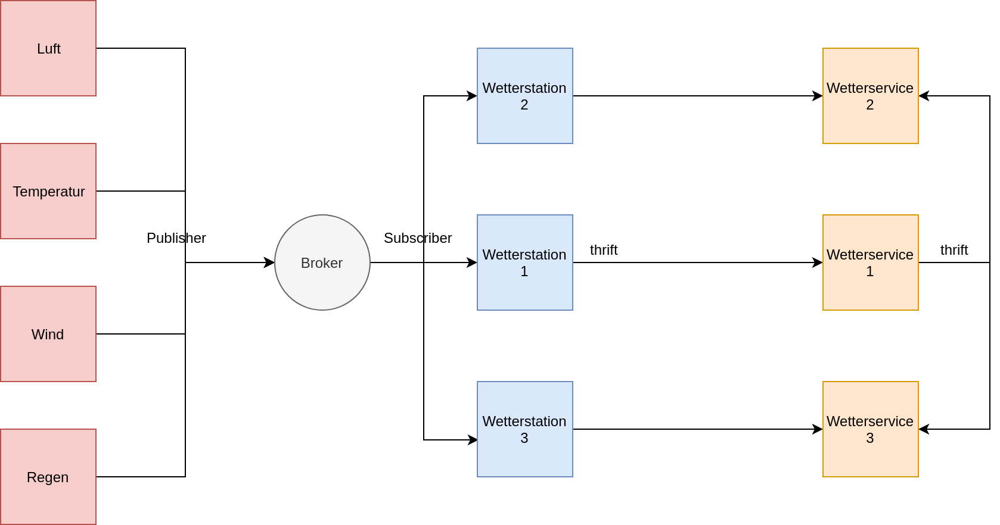

# Aufgabe
Im Rahmen des Praktikums sollen unterschiedliche Systeme rund um das Thema Wetterdienst simuliert werden. Dazu ist in mehreren Phasen jeweils ein Teil des Gesamtsystems zu erstellen. Am Ende müssen mehrere Wetterstationen (mindestens 3) mit verschiedenen Wetterdiensten kommunizieren. Die Server der Wetterdienste wiederum sollen aus Gründen der Performance und der Ausfallsicherheit redundant ausgelegt werden.

Der Fokus soll auf der Kommunikation der verteilten Komponenten untereinander sowie dem Software-Design, dem Testen und dem Ausrollen (Deployen) der verteilten Anwendungen liegen. Der Fokus liegt nicht darauf ein möglichst realistisches Sensorverhalten zu simulieren.

&nbsp;

# Systemdesign

&nbsp;

### Hochverfügbarkeit und MQTT

&nbsp;

# Sensoren

### Kommunikation mit der Wetterstation

##### MQTT
1. MqttPublisher
1. MqttParam

### Aufbau einer Sensor-Nachricht
1. NachrichtenId
1. SensorId
1. Sensortyp
1. Sensorwert

Die Attribute einer Sensornachricht werden, getrennt durch einen Pipe-Operator ("|") als Delimiter, als String veröffentlicht/versendet.

Die Sensoren sind durch ihre Id eindeutig identifizierbar. Jeder Sensorwert ist dabei durch seinen Zeitstempel eindeutig identifizierbar.

### Ausführen
Die [Docker-Datei](src/Sensordaten/docker-compose.yml) wird nur einmal ausgeführt, denn sie enthält bereits alle vier Sensoren. Einen Sensor für `wind`, `regen`, `luft` und `temp`.

Informationen zum Starten der Sensoren im [Deploymentplan][1].

&nbsp;

# Wetterdienst

### Kommunikation mit der Wetterstation

##### Thrift
1. WeatherServiceThriftServer
1. WeatherServiceImplementation
1. WeatherServiceUser
1. WeatherReport
1. Report
1. Location

### Kommunikation zwischen den Wetterdiensten

##### Thrift
1. Calc
1. Operands
1. ServerHandler
1. Result

### Ausführen
Die [Docker-Datei](src/Wetterservice/docker-compose.yml) wird nur einmal ausgeführt, denn sie enthält bereits alle drei Wetterdienste.

Informationen zum Starten der Wetterdienste im [Deploymentplan][1].

### Dateien

##### Report.json
Unter `data/report.json` findet man die persistent gespeicherten Sensordaten (auch in der Docker-Umgebung).

&nbsp;

# Wetterstation

### Kommunikation mit dem Wetterdienst

##### Thrift
1. WeatherStationThriftClient
1. WeatherReport
1. Report
1. Location

### Kommunikation mit den Sensoren

##### MQTT
1. MqttSubscriber
1. MqttParam

### HTTPServer
1. HTTPServer
1. Sensor

### Ausführen
Die [Docker-Datei](src/Wetterstation/docker-compose.yml) wird nur einmal ausgeführt, denn sie enthält bereits alle drei Wetterstationen.

Informationen zum Starten der Wetterstationen im [Deploymentplan][1].

### Dateien

##### internSensorData.txt
Diese Datei dient zum Speichern der Sensordaten die an der Wetterstation ankommen und später weiter an die Wetterdienste geschickt werden.

##### returnJsonFile.json
Diese Datei wird bei jeder Anfrage an die REST-API des HTTP-Servers mit den jeweiligen angefragten Sensordaten im JSON-Format zurückgegeben.

##### index.html
Diese Datei wird beim Aufruf des HTTP-Servers mit `localhost:8080` im Browser angezeigt.

##### 404.html
Diese Datei wird bei einer falsch verarbeiteten Anfrage im Browser angezeigt.

[1]: DEPLOY.md
